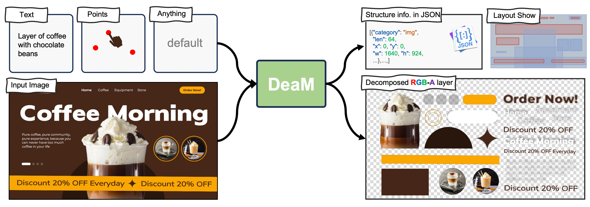
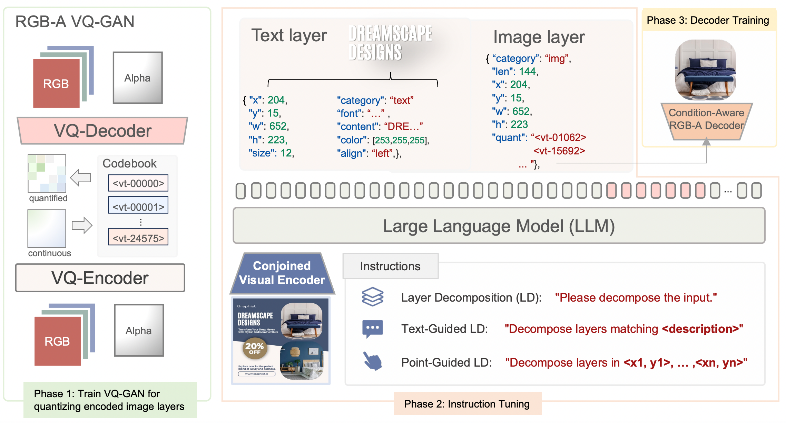
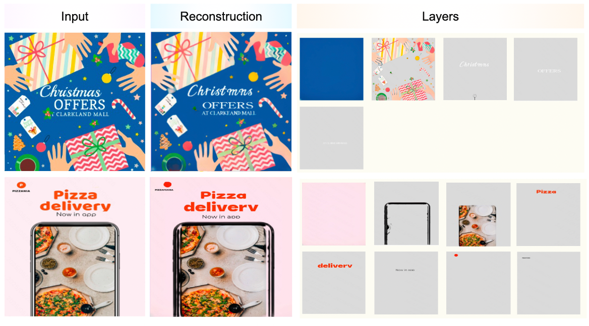
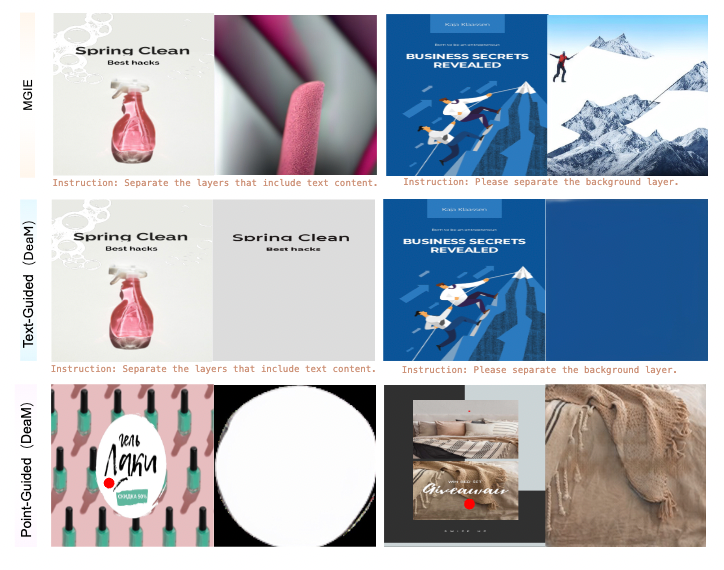

<p align="center" style="border-radius: 10px">
  
</p>

<h2 align="center">Decomposition of Graphic Design with Unified Multimodal Model</h2>

<h4 align="center">
    Hui Nie<sup>1</sup>&emsp;
    Zhao Zhang<sup>2</sup>&emsp;
    Yutao Cheng<sup>2</sup>&emsp;
    Maoke Yang<sup>2</sup>&emsp;
    <br>
    Gonglei Shi<sup>2</sup>&emsp;
    Qingsong Xie<sup>3</sup>&emsp;
    Jie Shao<sup>2</sup>&emsp;
    Xinglong Wu<sup>2</sup>&emsp;
    <br>
    <br>
    <sup>1</sup>University of Chinese Academy of Sciences
    <br>
    <sup>2</sup>ByteDance Intelligent Creation Lab, China
    <br>
    <sup>3</sup>OPPO AI Center 
</h4>

<div align="center">

[](https://openreview.net/pdf?id=7SG4s8d8AQ)

</div>


## Introduction
We introduce a new task, Layer Decomposition of Graphic Designs (LDGD), which involves decomposing a composite image into multiple layers (including the background, primary imagery, atmosphere graphics, text, etc.) in a logical layer order.

<p align="center"> </p>


**DeaM** Pipeline. The training process of DeaM consists of three phases: (1) VQ-GAN Training: Train an RGB-A VQ-GAN, then use it to encode all image layers with ”quant” annotations. (2) Instruction Tuning: Train DeaM to generate detailed image descriptions (metadata), performing layer decomposition tasks including element positions, layer order, indices in the VQ-GAN codebook, and so on. (3) Decoder Training: Train a condition-aware RGB-A decoder using ResNet as the condition encoder, keeping the VQ encoder frozen.

<p align="center"> </p>

## Experiments

<p align="center" style="border-radius: 10px">
  
<strong>Layer decomposition results of DeaM on the Crello dataset.</strong>
</p>

<p align="center" style="border-radius: 10px">
  
<strong>Results of point-guided and text-guided layer decomposition.</strong>
</p>

<p align="center" style="border-radius: 10px">
  
<strong>Comparison with Image Vectorization Method.</strong>
</p>


## To-Do List
- [ ] Release code
- [ ] Release arxiv paper


## Cite
 <p id="bib">If you find this work valuable, we kindly ask that you cite it. We look forward to increased attention from the research community toward LDGD task. </p>


```bibtex
@inproceedings{nie2025deam,
  title={Decomposition of Graphic Design with Unified Multimodal Model},
  author={Nie, Hui and Zhang, Zhao and Cheng, Yutao and Yang, Maoke and Shi, Gonglei and Xie, Qingsong and Shao, Jie and Wu, Xinglong},
  booktitle={ICML},
  year={2025}
}
```

## License
DeaM code is under CC-BY-NC-SA 4.0 license.